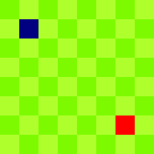

<div align="center">



# Win32Game

🕹️ Un semplice gioco scritto in C usando le Win32 API e GDI

[Requisiti](#requisiti)
·
[Compilazione](#compilazione)
·
[Autore](#autore)
·
[Licenza](#licenza)

</div>


# Requisiti

* Windows 10+
* Microsoft Visual C++ Redistributable 2015-2022


# Compilazione

### 1. Installa i prerequisiti:

* Visual Studio 2022
  * Sviluppo di applicazioni desktop con C++
* Git

### 2. Clona il repository:

```
git clone https://github.com/reallukee/win32game.git
```

### 3. Usa Visual Studio per compilare!


# Autore

* [Luca Pollicino](https://github.com/reallukee)


# Licenza

Licenza [MIT](./LICENSE)
